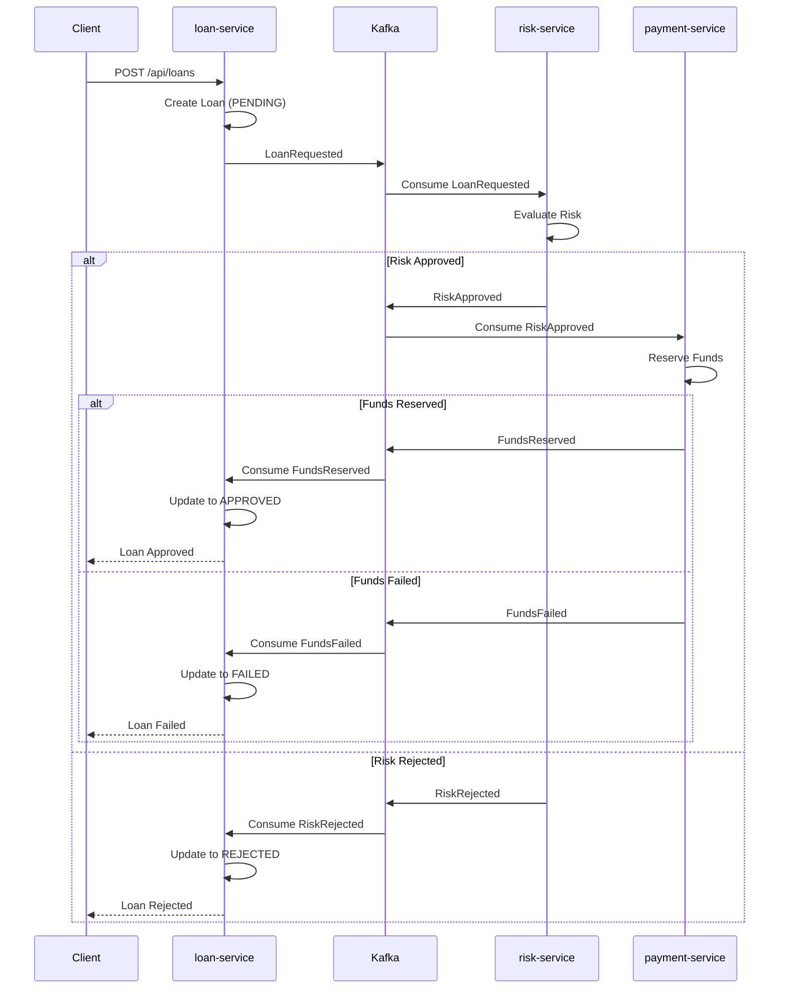

# Spring Boot Kafka Saga

A distributed saga pattern implementation using Spring Boot and Apache Kafka.

## Architecture

The project consists of 3 microservices:

- **loan-service**: Handles loan requests and coordinates the saga
- **risk-service**: Evaluates customer risk for loan approval
- **payment-service**: Processes payments and reserves funds
- **shared-events**: Common event classes shared across services

## Saga Flow



**Compensation**: On failure at any step, the saga publishes a compensating event to rollback the previous steps.

## Resilience4j

Fault tolerance patterns applied with [Resilience4j](https://resilience4j.readme.io/):

| Pattern | Instance | Module | Usage |
|---------|----------|--------|-------|
| Circuit Breaker | `loanConsumerCircuitBreaker` | loan-service | `LoanConsumer` (3 Kafka listeners) |
| Retry | `loanRetry` | loan-service | `LoanProducer.sendLoanRequested()` |
| Retry | `riskRetry` | risk-service | `RiskService.evaluateRisk()` |
| Circuit Breaker | `paymentCircuitBreaker` | payment-service | `PaymentService.processPayment()` |
| Retry + fallback | `paymentRetry` | payment-service | `ReserveFundsService.reserveFunds()` |

## OpenTelemetry / Distributed Tracing

Each service is instrumented with [OpenTelemetry](https://opentelemetry.io/) (SDK v1.38.0) for distributed tracing:

- **Auto-configuration**: `AutoConfiguredOpenTelemetrySdk` with `otel.service.name` set per module
- **Manual tracing**: `Tracer.spanBuilder()` in `LoanService`, `RiskService`, `PaymentService` and `ReserveFundsService`
- **Kafka**: `TracingProducerInterceptor` / `TracingConsumerInterceptor` on all producers and consumers, propagating tracing context through messages
- **HTTP**: `SpringWebMvcTelemetry` filter to automatically trace incoming REST requests
- **Exporter**: OTLP via gRPC to `otel-collector:4317`
- **Propagation**: W3C `tracecontext` + `baggage`

Required environment variables for the collector:

```env
OTEL_EXPORTER_OTLP_ENDPOINT=http://otel-collector:4317
OTEL_TRACES_EXPORTER=otlp
OTEL_PROPAGATORS=tracecontext,baggage
OTEL_METRICS_EXPORTER=none
OTEL_LOGS_EXPORTER=none
```

## Kafka Topics

- `loan-requested`
- `risk-approved`
- `risk-rejected`
- `funds-reserved`
- `funds-failed`

## Prerequisites

- Docker (for Kafka)
- Java 17+ and Maven

## Quick Start

```bash
# 1. Start Kafka
docker network create kafka-net
docker compose -f .devcontainer/kafka-compose.yml up -d

# 2. Build and start all services
./start.sh

# 3. Stop services
./stop.sh
```

## Build manual

```bash
mvn clean install -DskipTests
```

## Run individual

```bash
mvn -pl loan-service spring-boot:run   # puerto 9080
mvn -pl risk-service spring-boot:run   # puerto 8081
mvn -pl payment-service spring-boot:run # puerto 8082
```

## Usage

```bash
curl -X POST http://localhost:9080/api/loans \
  -H "Content-Type: application/json" \
  -d '{"customerId": "cust-001", "amount": 10000}'
```

## Test Customers

- `cust-001`: LOW risk, $50,000 limit
- `cust-002`: MEDIUM risk, $30,000 limit
- `cust-003`: HIGH risk (rejected automatically)

## OpenAPI / Swagger

- **loan-service**: http://localhost:9080/swagger-ui.html
- **loan-service** (JSON): http://localhost:9080/v3/api-docs
