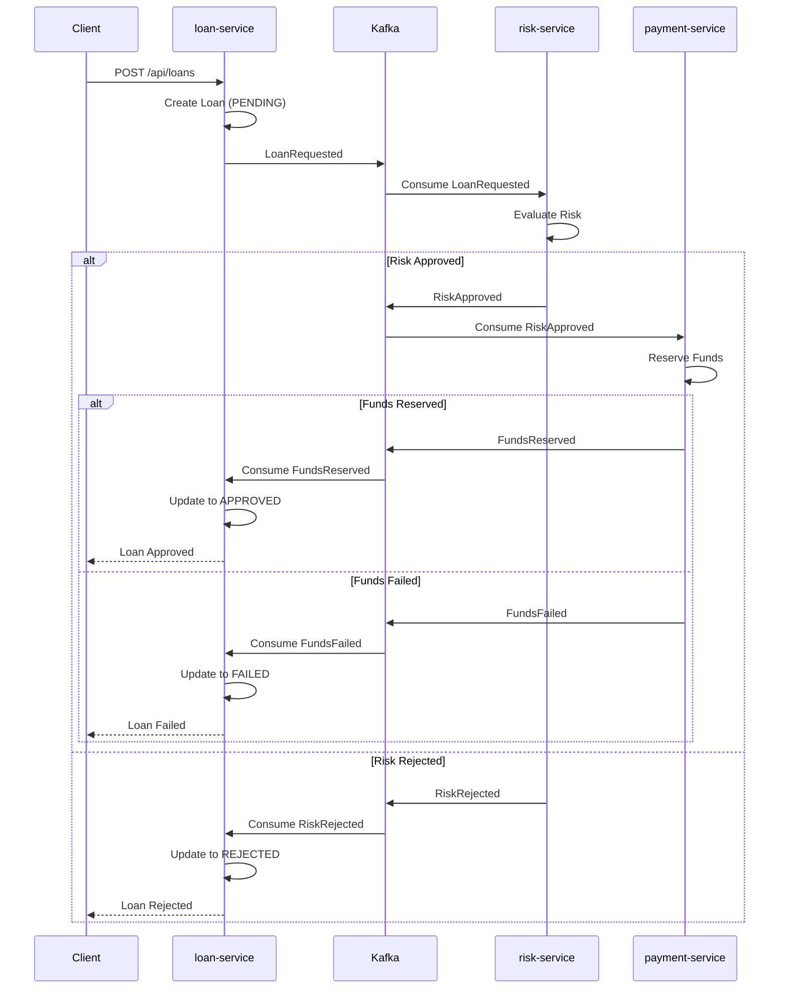

# Spring Boot Kafka Saga

A distributed saga pattern implementation using Spring Boot and Apache Kafka.

## Architecture

The project consists of 3 microservices:

- **loan-service**: Handles loan requests and coordinates the saga
- **risk-service**: Evaluates customer risk for loan approval
- **payment-service**: Processes payments and reserves funds
- **shared-events**: Common event classes shared across services

## Saga Flow



**Compensation**: On failure at any step, the saga publishes a compensating event to rollback the previous steps.
2. `loan-service` publishes `LoanRequested` event to Kafka
3. `risk-service` consumes the event, evaluates risk, publishes `RiskApproved` or `RiskRejected`
4. `payment-service` consumes `RiskApproved`, processes payment, publishes `FundsReserved` or `FundsFailed`
5. `loan-service` consumes the final event and updates loan status

## Kafka Topics

- `loan-requested`
- `risk-approved`
- `risk-rejected`
- `funds-reserved`
- `funds-failed`

## Build

The project uses a parent POM to manage all modules. Build from the root:

```bash
# Build and install all modules
mvn clean install
```

Or build from root with Spring Boot:

```bash
# Terminal 1 - loan-service (port 8080)
mvn -pl loan-service spring-boot:run

# Terminal 2 - risk-service (port 8081)
mvn -pl risk-service spring-boot:run

# Terminal 3 - payment-service (port 8082)
mvn -pl payment-service spring-boot:run
```

## Prerequisites

- Kafka running on broker:9092
- Start Kafka with: `cd .devcontainer && docker-compose -f kafka-compose.yml up -d`

## Usage

```bash
curl -X POST http://localhost:8080/api/loans \
  -H "Content-Type: application/json" \
  -d '{"customerId": "cust-001", "amount": 10000}'
```

## Test Customers

- `cust-001`: LOW risk, $50,000 limit
- `cust-002`: MEDIUM risk, $30,000 limit
- `cust-003`: HIGH risk (rejected automatically)

## OpenAPI / Swagger

Each service exposes OpenAPI documentation:

- **loan-service**: http://localhost:8080/swagger-ui.html
- **loan-service** (JSON): http://localhost:8080/v3/api-docs
